# Earth Day Hackathon

[Here is a link to the final project]()

## Design 

### Design Brief

#### Color Scheme

   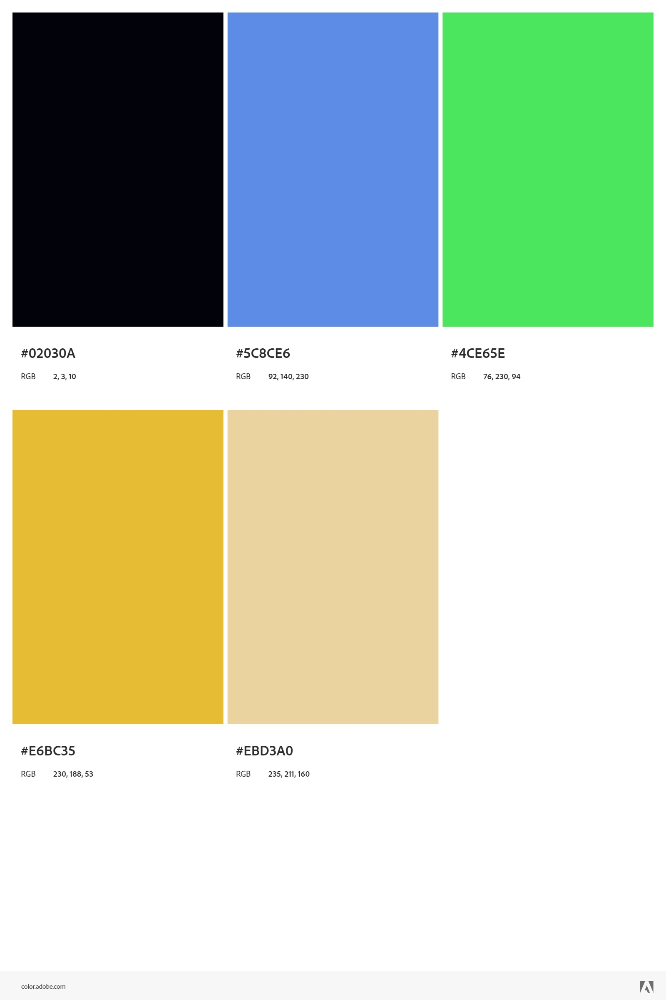

#### Wireframes

   + Land page

    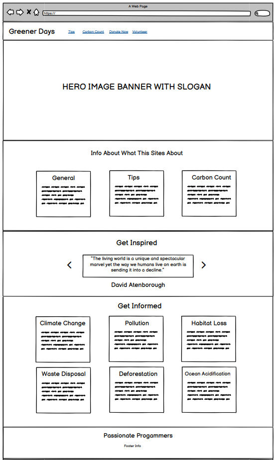
   
   + Crbon Counter

   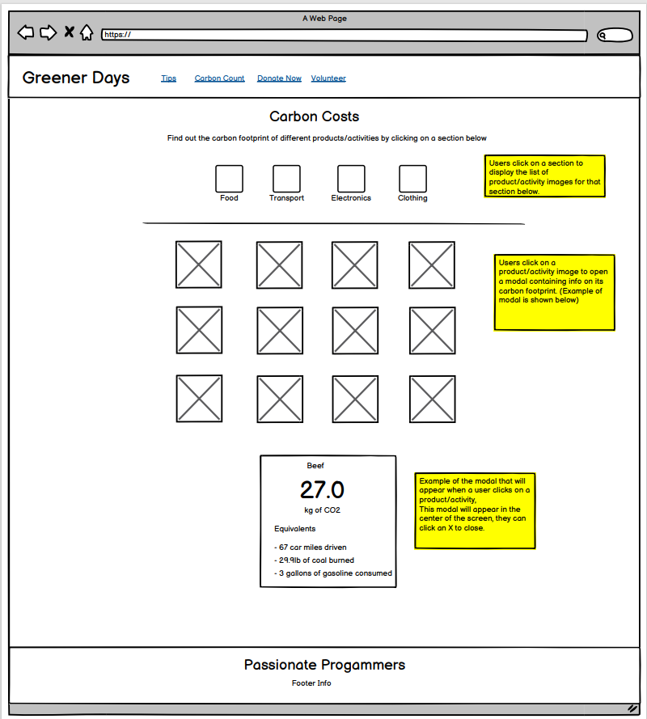

   + Tips 

   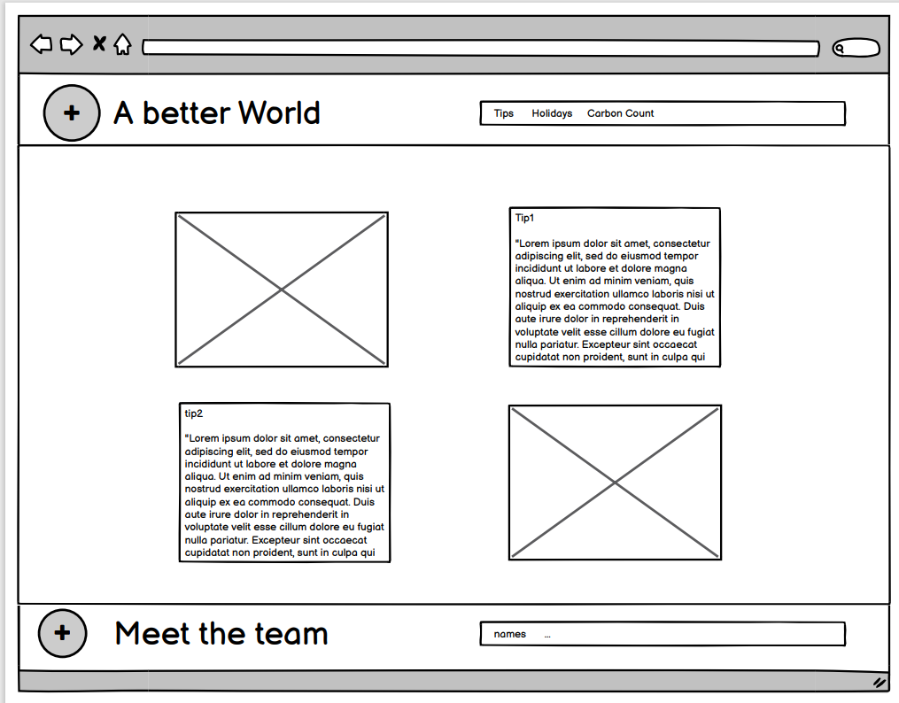

## Final Design

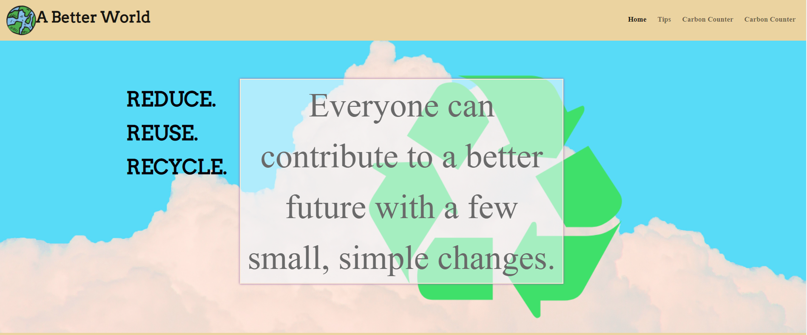

## Contents

* [User Experience](#USER-EXPERIENCE)  
    * [User Stories](#USER-STORIES)    

* [Design](#DESIGN)   
    * [Color Scheme](#COLOR-SCHEME)

* [Wireframes](#WIREFRAMES) 

* [Technologies Used](#TECHNOLOGIES-USED) 
    * [Languages Used](#LANGUAGES-USED)
    * [Programs Used](#PROGRAMS-USED)

* [Deployment](#DEPLOYMENT)
    * [Initial Deployment](#INITIAL-DEPLOYMENT)
    * [How To Fork A Repository](#HOW-TO-FORK-A-REPOSITORY)
    * [How To Clone A Repository](#HOW-TO-CLONE-A-REPOSITORY)
    * [How To Make A Local Clone](#HOW-TO-MAKE-A-LOCAL-CLONE)

* [Testing](#TESTING)
    * [Code Validators](#CODE-VALIDATORS)

* [Content](#CONTENT)
    * [Images](#IMAGES)
    * [Text Content](#TEXT-CONTENT)

* [Acknowledgements](#ACKNOWLEDGEMENTS)    

## User experience

## User stories

#### First time visitors

   + As a new user, I would liket to know what the website is about opening the site.
   + As a new user, I would like to get information about the website.
   + As a new user, I would like to see find some helpfull information and tips to become more eco-friedly.
   + As a new user, I would like to easily be able to interact with the page features.
   + As a new user, I would like to understand how the information is structured in the site.

#### Returning Users

   + As a repeat user, I would like to be able to find the information I need.
   + As a reteat user, I would like to easily return into the Carbon Count aplication.
   + As a repeat user, I would like to easily return into the Tips section.
   
#### All users 
 
   + As a user, I would like to get feedback when I have completed an action on the site.
   + As a user, I would like to be able to contact the website owners if there is an issue.

#### Website owners
  
   + As the owners, We want the users to find information easily.
   + As the owners, We want to inspire the users on how to become more eco-friendly.
   + As the owners, We want to help the users to transform old habits into more sustanaibles habits.  
   + As the owners We want to share with the users  sustanability facts and  stadistics  

## Features

### Main  

 #### Landing page:

   + When a user opens the site the are presented with the landing page

   + It contains a clear title and information about the application 

   + There are also cards with links to the relevant structured information  

   + There is an about us section and there are the 3 main sections of the page, General information, Tips and the Carbon Count. 

#### Navigation Bar:

   + The navigation menu has been made responsive and Interactive.

   + The navigation menu becomes and hamburger menu in small size screens 

   + We decided to add a spinning earth as Navbar logo

   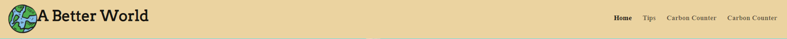

   

#### Carbon Counter:

   + In the Carbon Count section the users can click in one of the following familys: 
   
  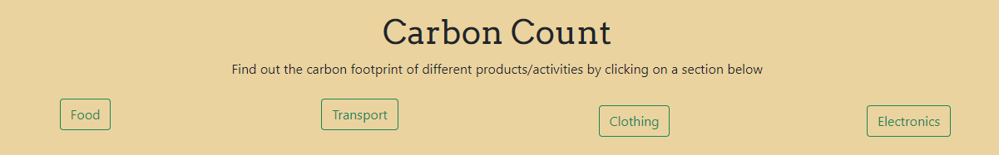

   + After click, a list of items will be shown and the user can click in each of the items to see the carbon footprint for each item:
  
  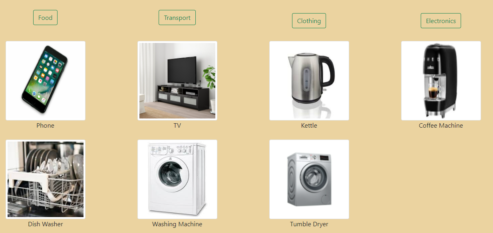

  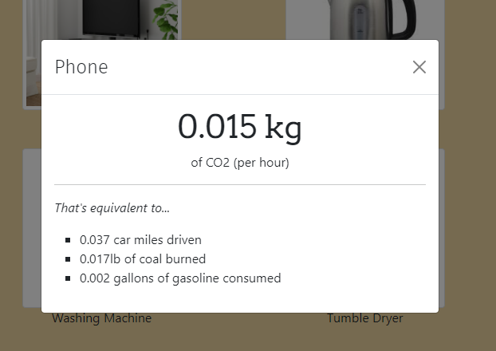
    

#### The Footer:

  + The footer includes an animation and links to all Team member's Github profiles 

    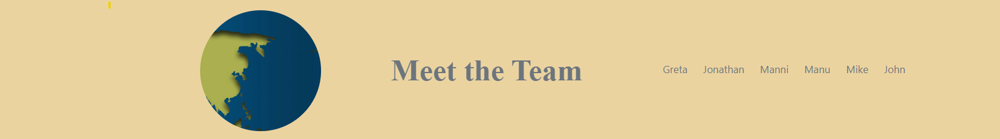

## Technologies Used

#### Languages Used: 

   + [HTML5](https://en.wikipedia.org/wiki/HTML5S).

     - HTML5 was used to create the content and base of each page.

   + [CSS3](https://en.wikipedia.org/wiki/CSS).

     - CSS3 was used to then style the page and make it responsive through media queries, and interactive through using CSS transitions.

   + [JavaScript](https://en.wikipedia.org/wiki/JavaScript).

     - javaScript was used throughout the website to make the site interactive.

 #### Frameworks Libraries and Programs.

   + [Font Awesome](https://fontawesome.com/) 
   
     - Font Awesome Was used for a few icons in the footer  on all of this site's pages.

   + [Google Fonts](https://fonts.google.com/)
   
     - Google Fnts Was used for all the text content on the site pages.

   + [Git](https://git-scm.com/).

     - Git was used for version control by using the Gitpod terminal to add and commit to GIt and push to Github.

   + [GitPod](https://gitpod.io/).
    
     - GitPod was used as an IDE whilst coding this site.

   + [GitHub](https://github.com/).
    
     - GitHub is being used to store all the code for this project after being pushed from GitPod.
   
   + [Balsamiq](https://github.com/).
    
     - Balsamiq was used in the initial design process to make wireframes.

   + [Google Developers Tool](https://developers.google.com/web/tools).
    
     - Developer Tools was used for trouble shooting and trying new visual changes without it affecting the current code.

## Deployment:

### Initial Deployment:

This site was deployed using GitHub Pages with the following the steps below:

1. Login or Sign Up to [GitHub](www.github.com).
2. Create a new repository named "".
3. Once created, click on "Settings" on the navigation bar under the repository title.
4. Click on "Pages", on the left hand side below Secrets.
5. Under "Source", choose which branch you wish to deploy, In most cases it will be "main".
6. Choose which folder to deploy from, generally from "/root".
7. Click "Save", then wait for it to be deployed. It may take some time for the page to be fully deployed.
8. The URL will be displayed above the "source" section in GitHub Pages.

### How to Fork a Repository

If you need to make a copy of a repository:

1. Login or Sign Up to [GitHub](www.github.com).
2. On GitHub, go to [manni8436/MS1-Project]().
3. In the top right corner, click "Fork".

### How to Clon a Repository

If you need to make a clone:    

1. Login in to [GitHub](www.github.com).
2. Fork the repository manni8436/MS1-Project(update) using the steps above in [How To Fork a Repository](#HOW-TO-FORK-A-REPOSITORY).
3. Above the file list, click "Code".
4. Choose if you want to close using HTTPS, SSH or GitHub CLI, then click the copy button to the right.
5. Open Git Bash.
6. Change the directory to where you want your clone to go.
7. Type git clone and then paste the URL you copied in step 4.
8. Press Enter to create your clone.

### How to make a Local Clone

If you need to make a local clone:   

1. Login in to [GitHub](www.github.com).
2. Under the repository name, above the list of files, click "Code".
3. Here you can either Clone or Download the repository.
4. You should close the repository using HTTPS, clicking on the icon to copy the link.
5. Open Git Bash.
6. Change the current working directory to the new locaiton, where you want the cloned directory to be.
7. Type git clone and then paste the URL you copied in step 4.
8. Press Enter, and your local clone will be created.

## Testing

### Code validators

The W3C Markup Validator and W3C CSS Validator was used to validate my project to make sure there were no errors within the site.

* W3C HTML Validator Results
    * [HTML]()

* W3C CSS Validator Results
    * [CSS]()

### Lighthouse

 + 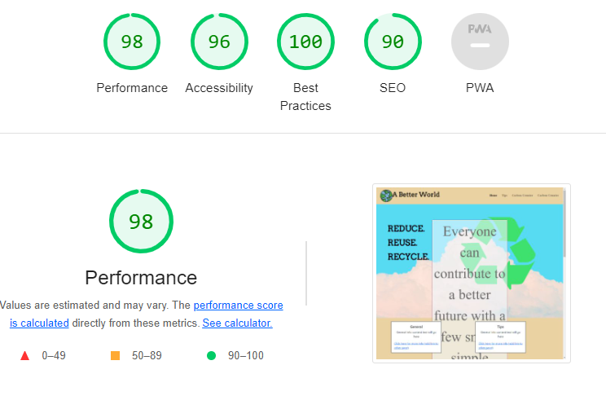

### Desktop

### Mobile

## Content

   + The content of this website were find searching the relevant information in differents websites with stadistics and information related with climate change, eco-habits, and different forms of contamination:

   * [Cardbord Print Stadistics](https://www.visualcapitalist.com/comparing-the-carbon-footprint-of-transportation-options/)

   * [Co2 Calculators ](https://www.epa.gov/energy/greenhouse-gas-equivalencies-calculator#results/)

   * [Plastic in the Ocean](https://www.condorferries.co.uk/marine-ocean-pollution-statistics-facts#:~:text=PLASTIC%20IN%20THE%20OCEAN%20FACTS%20%26%20STATISTICS&text=oceans%20every%20year.-,There%20are%205.25%20trillion%20pieces%20of%20plastic%20waste%20estimated%20to,15%25%20lands%20on%20our%20beaches)

   * [Tips and Ideas](https://eu.usatoday.com/story/money/2019/06/17/climate-change-30-ways-to-make-your-life-more-environmentally-friendly/39366589/)

## Acknowledgements

